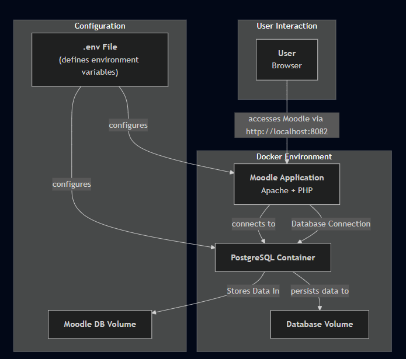

# Moodle Deployment with Docker

This project provides a simple way to deploy a Moodle learning management system (LMS) using Docker and Docker Compose. It sets up a Moodle application container and a PostgreSQL database container, making it easy to get a Moodle instance running for development or small-scale production environments.

## 🏗️ Architecture Overview

The architecture is straightforward, consisting of two main Docker containers:

- **`moodle`**: An application container running Moodle with an Apache web server.
- **`moodle_db`**: A database container running PostgreSQL to store Moodle's data.

The application is exposed on port `8082`, and Docker volumes are used to persist the database data and Moodle application files.

### Architecture Diagram



## ✅ Requirements

Before you begin, ensure you have the following installed:

- [Docker](https://docs.docker.com/get-started/get-docker/)
- [Docker Compose](https://docs.docker.com/compose/install/)

## 🚀 Getting Started

Follow these steps to get your Moodle instance up and running.

### 1. Clone the Repository

If you haven't already, clone this repository to your local machine.

```
git clone <your-repository-url>
cd <your-repository-directory>
```

### 2. Configure Your Environment

Create a .env file by copying the provided distribution file. This file will store your environment-specific configurations, such as passwords and admin credentials.

```
cp .dist-env .env
```

Now, open the `.env` file and fill in the required values for the Moodle admin, database credentials, and any other settings you wish to customize.

### 3. Launch the Application

With your `.env` file configured, you can now start the Moodle application using Docker Compose.

```bash
docker-compose up -d
```

This command will download the necessary Docker images and start the Moodle and database containers in the background.

## 🌐 Accessing Moodle

Once the containers are running, you can access your Moodle instance by navigating to the following URL in your web browser:
URL: http://localhost:8082

You can log in with the admin credentials you specified in your .env file.

## ⚙️ Managing the Application

To stop the application:

```
docker-compose down
```

To view logs:

```
docker-compose logs -f
```

## 🧩 Technologies Used

- Docker: Containerization platform.
- Docker Compose: Tool for defining and running multi-container Docker applications.
- Moodle: The learning management system.
- PostgreSQL: The database used for Moodle.
- Apache: The web server running inside the Moodle container.
